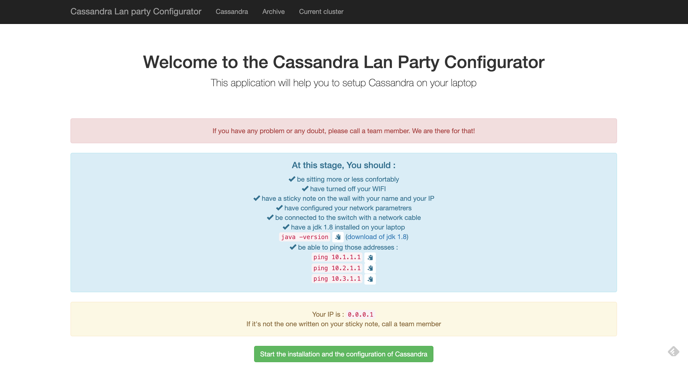
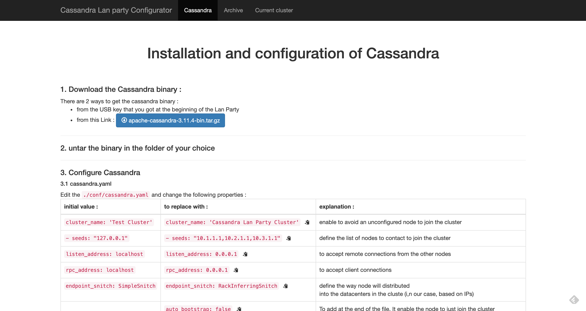
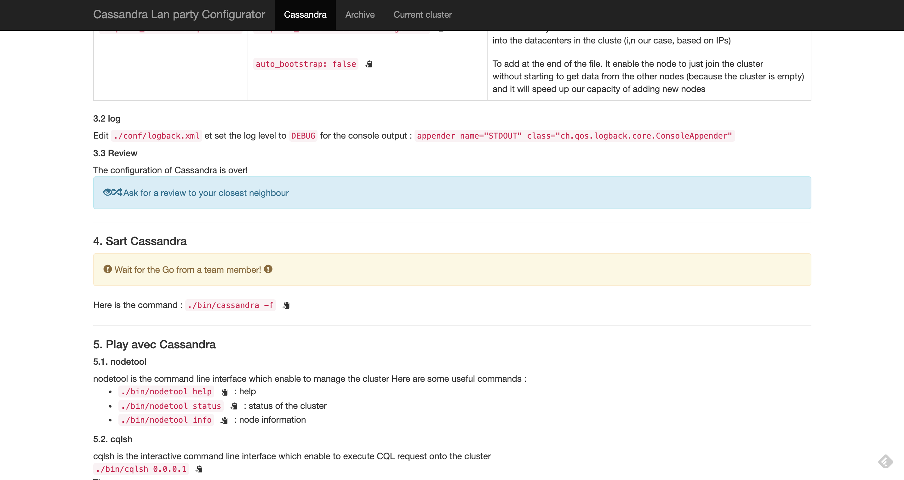
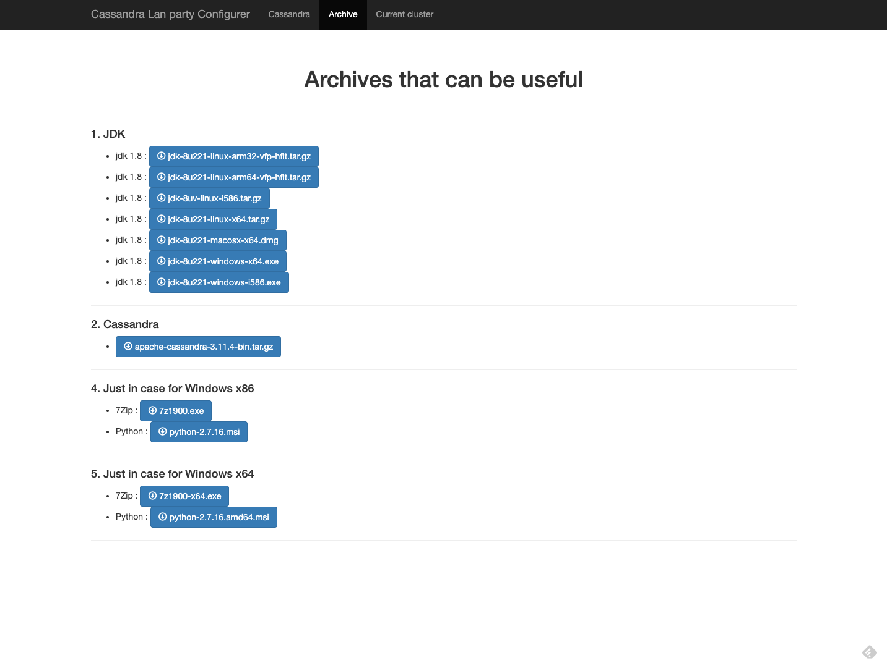
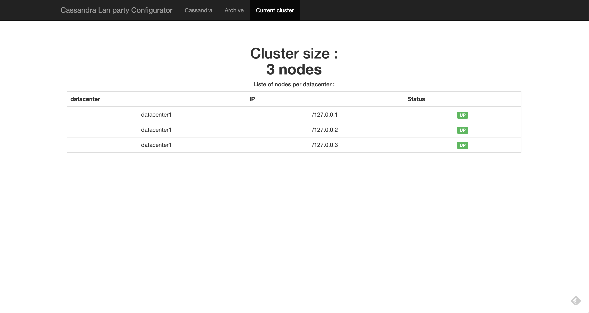

# Casssandra Lan Party Configurator
application that ease the setup of a Cassandra Lan Party

The application is a simple Spring boot + Thymeleaf web application

To use it : clone it and you can start the CassandraLanPartyConfiguratorApplication.java from your IDE

